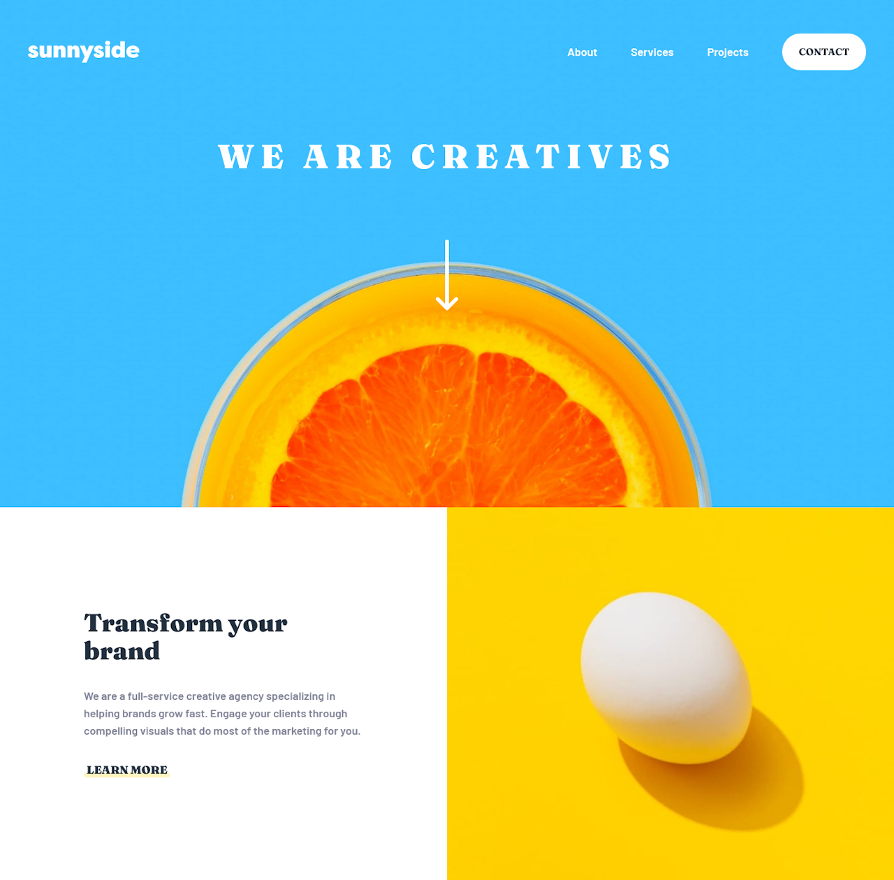

# Frontend Mentor | Sunnyside agency landing page solution

This is a solution to the [Sunnyside agency landing page challenge on Frontend Mentor](https://frontendmentor.io/challenges/sunnyside-agency-landing-page-7yVs3B6ef).

## Table of contents

- [Overview](#overview)
  - [The challenge](#the-challenge)
  - [Screenshot](#screenshot)
  - [Links](#links)
- [My process](#my-process)
  - [Built with](#built-with)
  - [What I learned](#what-i-learned)
  - [Continued development](#continued-development)
- [Author](#author)

## Overview

### The challenge

- Build out the project to the designs inside the [/design](/design) folder

Users should be able to:

- View the optimal layout for the site depending on their device's screen size (mobile viewport width: 375px, desktop viewport width: 1440px)
- See hover states for all interactive elements on the page
- Show and hide the navigational menu on the mobile page layout

### Screenshot

### Links

- Solution URL: [https://github.com/kasperkouhia/agency-landing-page](https://github.com/kasperkouhia/agency-landing-page)
- Live Site URL: [https://kasperkouhia.github.io/agency-landing-page](https://kasperkouhia.github.io/agency-landing-page)

## My process

### Built with

- Mobile-first workflow
- Semantic HTML
- [React](https://react.dev/)
- [Tailwind CSS](https://tailwindcss.com/)
- [Vite](https://vite.dev/)
- [vite-plugin-svgr](https://github.com/pd4d10/vite-plugin-svgr)

### What I learned

- Learned the very basics of Vite + React web development
- Learned how to style elements using Tailwind CSS
  - Got a start on using a utility class-focused approach to styling elements
- Learned how to get the most out of SVG files by use of SVGR/SVGO
  - The options `"removeDimensions"` and `"convertColors"` were especially useful for scaling and recoloring an SVG, respectively

### Continued development

- Still got plenty more to learn about React
  - Should especially look at trying to understand the "React mindset" better
- Could probably get more out of Tailwind with a little more theme customization
  - Also need to evaluate if Tailwind is even the right choice for certain projects (such as this one)
  - _Still not entirely sure Tailwind is for me, to be honest_
- Still need to figure out better, smoother ways to transition between different layouts
  - Ideally ones that are easy to implement

## Author

- GitHub - [kasperkouhia](https://github.com/kasperkouhia)
- LinkedIn - [Kasper Kouhia](https://linkedin.com/in/kasper-kouhia-220b91357)
